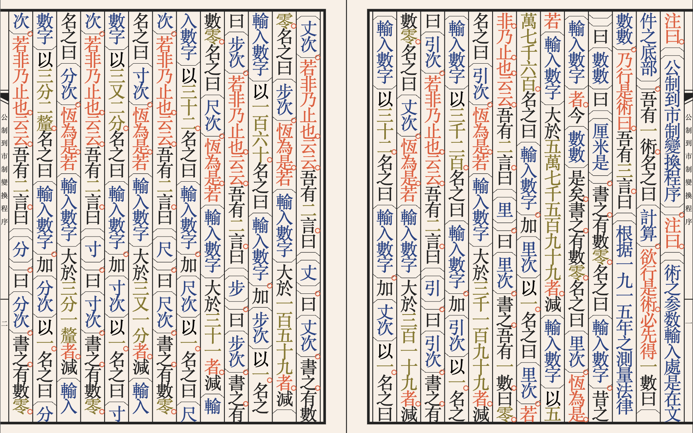
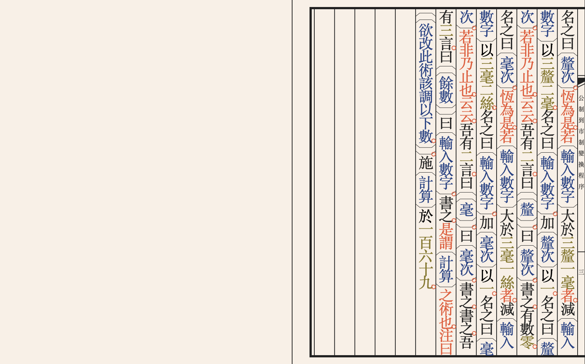

### This program converts a Metric measurement to that of the ShiZhi 市制 Market System according to regulations circa 1915. 
  

**CONVERSION SYSTEM:**

    毫 = 0.0032cm    寸 = 3.2cm     步 = 160cm     引 = 3200cm		１ ２ ３ ４ ５ ６ ７ ８ ９ １０
    分 = 0.32cm      尺 = 32 cm     丈 = 320cm     里 = 57600cm		一 二 三 四 五 六 七 八 九  十
    
    
**EXAMPLE OUTPUT:** 
```
根据一九一五年之測量法律 六百五十七又三分 厘米是	   	(According to 1915 regulations, 557.3 meters is:
		
丈 二							2 Zhang
寸 五							5 Cun
分 四							4 Fen
毫 六							6 Hao
		
餘數 八絲						Remainder: 0.0008)
```
 
**PROGRAM STARTS:**
Try compiling [here](https://ide.wy-lang.org)   
To change the calculation, adjust 施「計算」於_____。 at the very end of the program.   
```
注曰。「「公制到市制變換程序」」。
注曰。「「術之参数輸入處是在文件之底部」」。

吾有一術。
名之曰「計算」。
欲行是術。必先得一數曰「數數」。
乃行是術曰。
	
	吾有三言。曰「「根据一九一五年之測量法律」」曰「數數」曰「「厘米是」」。
	   書之。
	有數零。名之曰「輸入數字」。				
	   昔之「輸入數字」者。今「數數」是矣。					
	書之。
	
	疏曰。「「57600 - 里」」。
	有數零。名之曰「里次」。
	恆為是。
	    若「輸入數字」大於五萬七千五百九十九者。
	       減「輸入數字」以五萬七千六百。		
	          名之曰「輸入數字」。
	       加「里次」以一。名之曰「里次」。				 
	    若非。
	       乃止。
	    也。
	云云。
	
	若「里次」不等於零者。
	    吾有二言。
	        曰「「里」」。
	        曰「里次」。
	    書之。
	也。


	注曰「「從現在起術之格式應當是像文章似的」」。

	疏曰「「3200 - 引」」。
	吾有一數。曰零。名之曰「引次」。
	恆為是。若「輸入數字」大於三千一百九十九者。
	減「輸入數字」以三千二百。名之曰「輸入數字」。加「引次」以一。名之曰「引次」。
	若非乃止也。云云。
	若「引次」不等於零者。
	吾有二言。曰「「引」」。曰「引次」。
	書之也。	
		
	疏曰「「320 - 丈」」。
	有數零。名之曰「丈次」。
	恆為是。若「輸入數字」大於三百一十九者。
	減「輸入數字」以三百二十。名之曰「輸入數字」。加「丈次」以一。名之曰「丈次」。		
	若非乃止也。云云。
	若「丈次」不等於零者。
	吾有二言。曰「「丈」」。曰「丈次」。
	書之也。

	疏曰「「160 - 步」」。
	有數零。名之曰「步次」。							
	恆為是。若「輸入數字」大於一百五十九者。
	減「輸入數字」以一百六十。名之曰「輸入數字」。加「步次」以一。名之曰「步次」。		
	若非乃止也。云云。	
	若「步次」不等於零者。
	吾有二言。曰「「步」」。曰「步次」。
	書之也。

	疏曰「「32 - 尺」」。
	有數零。名之曰「尺次」。
	恆為是。若「輸入數字」大於三十一者。
	減「輸入數字」以三十二。名之曰「輸入數字」。加「尺次」以一。名之曰「尺次」。		
	若非乃止也。云云。
	若「尺次」不等於零者。
	吾有二言。曰「「尺」」。曰「尺次」。
	書之也。

	疏曰「「3.2 - 寸」」。
	有數零。名之曰「寸次」。
	恆為是。若「輸入數字」大於三又一分者。
	減「輸入數字」以三又二分。名之曰「輸入數字」。加「寸次」以一。名之曰「寸次」。		
	若非乃止也。云云。
	若「寸次」不等於零者。
	吾有二言。曰「「寸」」。曰「寸次」。
	書之也。

	疏曰「「0.32 - 分」」。				
	有數零。名之曰「分次」。
	恆為是。若「輸入數字」大於三分一釐者。
	減「輸入數字」以三分二釐。名之曰「輸入數字」。加「分次」以一。名之曰「分次」。		
	若非乃止也。云云。
	若「分次」不等於零者。
	吾有二言。曰「「分」」。曰「分次」。
	書之也。

	疏曰「「0.032 - 釐」」。
	有數零。名之曰「釐次」。
	恆為是。若「輸入數字」大於三釐一毫者。
	減「輸入數字」以三釐二毫。名之曰「輸入數字」。加「釐次」以一。名之曰「釐次」。		
	若非乃止也。云云。	
	若「釐次」不等於零者。
	吾有二言。曰「「釐」」。曰「釐次」。
	書之也。

	疏曰「「0.0032 - 毫」」。
	有數零。名之曰「毫次」。
	恆為是。若「輸入數字」大於三毫一絲者。
	減「輸入數字」以三毫二絲。名之曰「輸入數字」。加「毫次」以一。名之曰「毫次」。		
	若非乃止也。云云。
	若「毫次」不等於零者。
	吾有二言。曰「「毫」」。曰「毫次」。
	書之也。

	書之。	
	吾有三言。曰「「餘數」」曰「輸入數字」。書之。

是謂「計算」之術也。

	注曰「「欲改此術該調以下數。」」。
	施「計算」於 三百二十一。


```

**PSEUDOCODE TRANSLATION**
```
I have a technique
It is named "Calculate". 
Those who wish to use this technique must first get a number named "Number". 
Thereafter carry out this technique so:
	
	I have 3 utterances. Say "According to 1915 measurement regulations" Say 'Number' Say "meters is:"
	   Write it so.
	There is a 0. Name it "Input Number".
	   The prior item 'Input Number' now becomes that of 'Number'.
	
	// Annotation: 57600 - LI.
	There is a 0, named "LI counter".
	Do this forever:
	    Supposing 'Input Number' is being greater than 57599,
	       Decrement 'Input Number' by 57600.
	          Name it 'Input Number'.
	       Increment 'LI counter' by one. Name it 'LI counter'.
	    Otherwise,
	       Stop.
	    End.
	And so forth。
	
	Supposing 'LI counter' is not equal to 0.
	    I have two utterances.
	        Say    "LI".
		Output 'LI counter'.
	    Write it so.
	End.
```
  
**BOOK RENDER:**   



