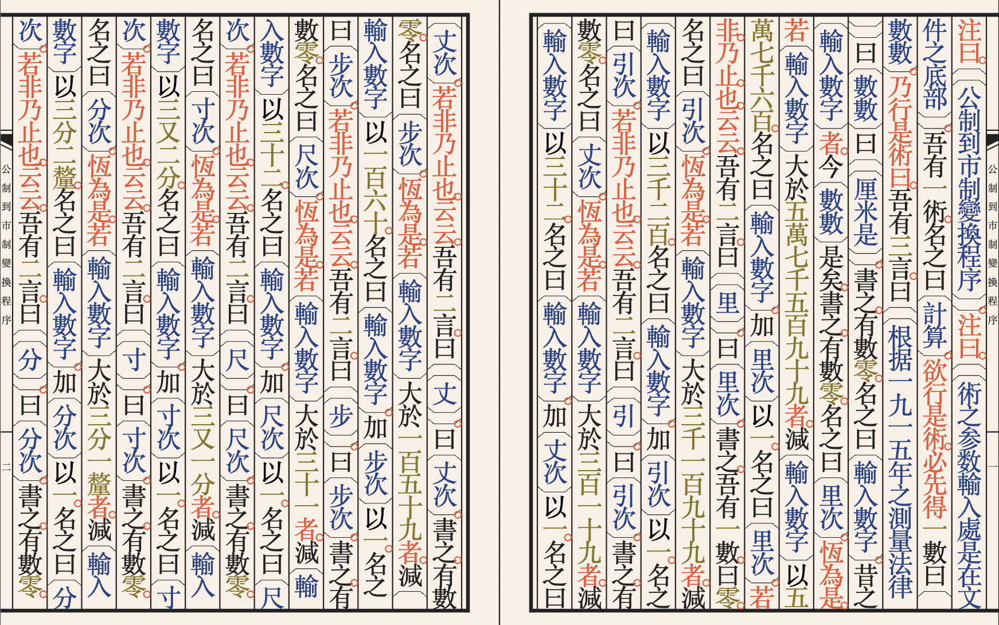

*"文言, or wenyan, is an esoteric programming language that closely follows the grammar and tone of classical Chinese literature. Moreover, the alphabet of wenyan contains only traditional Chinese characters and 「」 quotes, so it is guaranteed to be readable by ancient Chinese people."*.
[Official Site](https://wy-lang.org/) / [Online IDE](https://ide.wy-lang.org/)  

I am self-studying Mandarin Chinese & Cantonese，所以這程式語言吸引了我的注意力。

### EXAMPLE/PSEUDOCODE TRANSLATION:
```
 吾有一數。曰十。名之曰「次」。
 有數零。名之曰「拾」。
 有數零。名之曰「計算」。
    為是「次」遍。
      加「拾」以一。名之曰「拾」。
      加「計算」以「拾」。名之曰「計算」。
    云云。
 吾有一言。曰「計算」。書之。
``` 
```
I have one number. The number 10. It is called "Times".
There is the number 0, called "Ten".
There is the number 0, called "Calculate".
   For "Times" times:
      Increment "Ten" by 1. Call it "Ten".
      Increment "Calculate" by "Ten". Call it "Ten".
   And so on.
I have one utterance. It is said "Calculate". Write it.
```
### A book render of my [Metric To Market System](https://github.com/CallumBeaney/WenYan-Experiments/blob/main/02.%20Metric%20to%20ShiZhi%20Converter.md) program:


